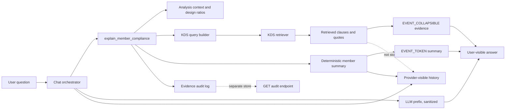

# System Overview

## One-paragraph description

Phase D connects frame-analysis design-check results to a KDS-RAG chat tool.
The chat system routes member-specific questions to a deterministic compliance
tool, retrieves code evidence, renders a fixed summary and collapsible evidence
block for the user, and stores a separate evidence audit log for provenance.
The LLM is limited to a short prefix and is prevented from authoring code
citations.

## Architecture

## Component responsibilities

| Component | Responsibility | Paper relevance |
|-----------|----------------|-----------------|
| `orchestrator.py` | Route chat turns, stream events, keep provider history | P1 invariant, anti-hallucination boundary |
| `kds_compliance.py` | Convert selected member result to deterministic summary and RAG query | Ratio-to-clause provenance |
| `core/kds_rag/pipeline.py` | Map issue types to topics, limit states, and query seeds | P3 retrieval-routing contribution |
| `chat_audit_log.py` | Store audit records in memory and JSONL with retention controls | Reproducibility and operational hardening |
| `chat_router.py` | Expose audit read endpoint with access control and redaction | Shared-deployment safety |
| Prefix sanitizer | Discard empty, fabricated, or overlong LLM prefix | LLM narration guard |

## Data flow for one NG member

1. User asks why a selected member is NG.
2. The chat tool resolves `analysis_id`, `member_id`, and design ratios.
3. The tool computes exceeded ratios and governing ratio.
4. The governing ratio maps to an `issue_type`.
5. `issue_type` maps to KDS query topic, limit state, and keyword seed.
6. Retriever returns KDS evidence chunks.
7. Server renders summary and collapsible evidence.
8. Audit log records member, ratios, issue type, query, evidence metadata, and
   quote text.
9. Provider-visible assistant history stores only prefix and summary, not the
   evidence quote body.

## Invariant worth preserving in the paper

The system does not rely on the LLM to "be careful" with citations. The
architecture removes citation authorship from the LLM path: evidence quotes are
rendered by deterministic server code, excluded from provider-visible history,
and stored separately for audit.
